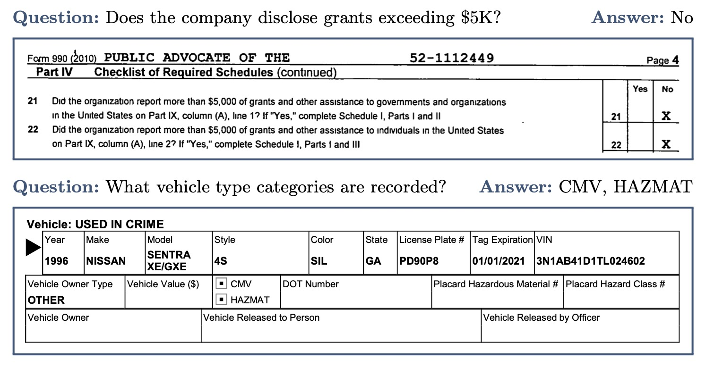

# Public Repository for CheckboxQA Dataset

CheckboxQA consists of varied questions requiring interpretation of 
checkable content in the context of visually rich documents. 
Required answers range from simple yes/no to lists of values. 
The dataset is intended solely for evaluation purposes.

</img>

This repository contains data and scripts for working with the CheckboxQA dataset.
The scripts include functionality for downloading documents and running evaluations.

## Data
Questions and answers for CheckboxQA is available in the `data/gold.jsonl`. It follows DUE data format.

Documents can be downloaded using the `download_documents.py` script. 

## Scripts

#### Requirements
```bash
pip install -r requirements.txt
```

### `download_documents.py`

This script downloads PDF documents.

#### Usage

```bash
python download_documents.py --json_path <path_to_json> --out_dir <output_directory>
```

#### Arguments
* `--json_path`: Path to the JSON file containing the documents to download (default: `data/document_url_map.json`).
* `--out_dir`: Directory to save the downloaded documents.

### `evaluate.py`
This script evaluates a model's predictions against the CheckboxQA dataset and returns ANLS* score.

#### Usage

```bash
python evaluate.py --pred <path_to_predictions> --gold <path_to_gold_standard>
```

#### Arguments
* `--pred`: Path to the JSON file containing the model's predictions.
* `--gold`: Path to the JSON file containing the gold standard (default: `data/gold.jsonl`).

### Citation
```
@misc{turski2025uncheckedoverlookedaddressingcheckbox,
      title={Unchecked and Overlooked: Addressing the Checkbox Blind Spot in Large Language Models with CheckboxQA}, 
      author={Michał Turski and Mateusz Chiliński and Łukasz Borchmann},
      year={2025},
      eprint={2504.10419},
      archivePrefix={arXiv},
      primaryClass={cs.CL},
      url={https://arxiv.org/abs/2504.10419}, 
}
```

### License
This dataset is intended for non-commercial research purposes and is provided under the CC BY-NC license.  
Please refer to DocumentCloud's terms of service at
[https://www.documentcloud.org/home/](https://www.documentcloud.org/home/) for information regarding the rights of the underlying document.
